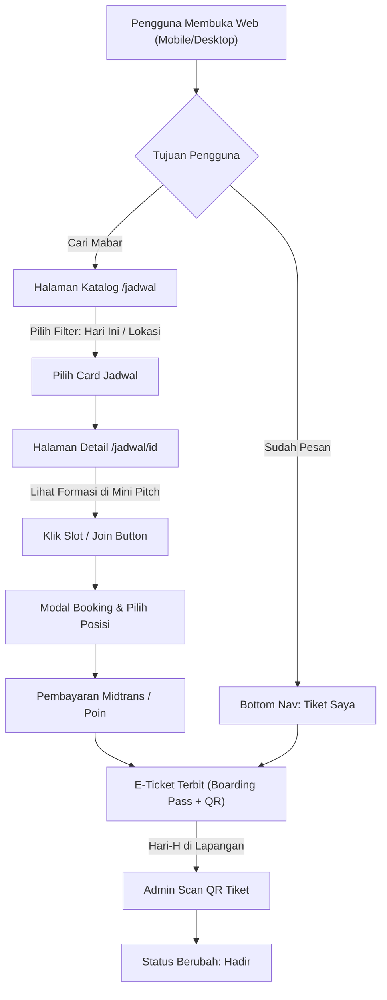

# Product Requirements Document (PRD): UI/UX Enhancement
**Project Name:** Yuk Main Bola  
**Document Version:** 1.0.0 (UI/UX Track)  
**Date:** September 2026  
**Status:** Ready for Implementation  
**Target Platform:** Web (Mobile-First Responsive) & PWA (Progressive Web App)

---

## 1. Executive Summary & Latar Belakang

### 1.1 Masalah Saat Ini (Problem Statement)
- **Dominasi Pengguna Mobile:** Lebih dari 85% pemain bola membuka situs melalui smartphone di perjalanan atau di pinggir lapangan. Layout saat ini masih berbasis desktop (top navigation bar fixed, tanpa bottom navigation bar).
- **Kurangnya Nuansa Sporty & Emosional:** Tampilan kartu jadwal dan tiket masih berbentuk card statis standar. Belum ada visualisasi yang memicu antusiasme sepak bola (seperti tiket pertandingan/boarding pass, formasi lapangan, atau countdown kickoff).
- **Keterbatasan Aksesibilitas Outdoor:** Tema gelap pekat (*dark green* `#0a1c15` & teks muted `#9badb2`) estetik di dalam ruangan, namun sulit dibaca di bawah terik matahari siang saat pemain mencari informasi venue di lokasi.
- **Ketiadaan Halaman Katalog Khusus:** Tombol *"Lihat Semua Jadwal"* belum memiliki halaman eksplorasi dengan filter interaktif yang nyaman digunakan dengan satu tangan (one-handed thumb zone).

### 1.2 Tujuan & Sasaran (Objectives & Goals)
1. Menghadirkan pengalaman aplikasi native (*app-like experience*) di browser seluler dengan **Mobile Bottom Navigation** dan **PWA Support**.
2. Meningkatkan rasio konversi booking melalui **Live Urgency Indicators** dan alur booking satu jempol.
3. Menciptakan kebanggaan berkomunitas melalui visualisasi **E-Ticket Boarding Pass** yang siap dibagikan (*shareable*) ke WhatsApp dan Instagram Story.
4. Memberikan kepastian komposisi tim dengan **Interactive Pitch View (Formasi Lapangan Hijau)**.
5. Memastikan kenyamanan pembacaan di luar ruangan (*outdoor readability*) dengan **Outdoor / High-Contrast Mode**.

---

## 2. Target Pengguna & Persona

| Persona | Konteks Penggunaan | Kebutuhan Utama UI/UX |
| :--- | :--- | :--- |
| **Rian (Pemain Solo / Weekend Warrior)** | Membuka HP saat istirahat kerja atau otw lapangan mabar. | Pencarian jadwal cepat, filter hari ini/weekend, booking 1 klik, tiket ber-QR code di profil. |
| **Bayu (Kapten Komunitas / Pemesan Grup)** | Memesan untuk 3-5 temannya sekaligus. | Melihat siapa saja yang sudah join, posisi yang masih kosong, dan pembagian tiket ke teman. |
| **Dimas (Admin / Koordinator Lapangan)** | Berdiri di pinggir lapangan membawa smartphone di bawah lampu sorot/matahari. | Kontras layar tinggi, scanner QR tiket cepat tanpa reload, status kehadiran instan. |

---

## 3. Design System & Token Visual

### 3.1 Palet Warna & Semantic Tokens
Aplikasi mempertahankan identitas brand *Yuk Main Bola* (Mint Green, Pitch Green, Warm Gold, Ivory Text), dengan penambahan mode kontras tinggi:

```css
/* Core Sport Theme */
--bg-pitch-dark: #0a1c15;      /* Dark Green base */
--bg-surface: #11281f;         /* Card & Container surface */
--bg-surface-elevated: #1a382b;/* Popover, modal, dropdown */

--color-primary: #6fc5a4;       /* Mint Green (Brand Accent & Main Action) */
--color-primary-hover: #5bb090;
--color-primary-glow: rgba(111, 197, 164, 0.25);

--color-accent-gold: #ffd40c;   /* Rating, VIP, Urgency Warning */
--color-danger: #ef4444;        /* Slot Penuh, Batalkan, Error */

--text-primary: #fcfbf5;        /* Warm Ivory (High contrast) */
--text-muted: #9badb2;          /* Secondary details */
--text-inverse: #0a1c15;        /* Dark text on primary buttons */

/* Outdoor High-Contrast Mode (Light / Sunlight Mode) */
--outdoor-bg: #f8faf9;
--outdoor-surface: #ffffff;
--outdoor-text: #0f241c;
--outdoor-text-muted: #4a5d54;
--outdoor-primary: #108e5c;
```

### 3.2 Tipografi & Ikonografi
- **Headings & Display:** Sans-serif bold (*Plus Jakarta Sans* / *Inter*) dengan tracking rapat bergaya poster olahraga modern.
- **Data & Timer:** Monospaced font (*JetBrains Mono* / tabular-nums) untuk jam, sisa slot, dan countdown mundur.
- **Ikonografi:** `lucide-react` dengan stroke width 2px konsisten.

### 3.3 Komponen Bentuk (Shape & Elevation)
- Radius standar: `rounded-xl` (12px) untuk cards, `rounded-full` untuk pills dan badges.
- Efek *Glassmorphism*: `backdrop-blur-md` dengan border semi-transparan `border-white/10`.

---

## 4. Spesifikasi Fitur UI/UX

### 4.1 Modul 1: Mobile-First Shell & Bottom Navigation Bar

#### Deskripsi
Navigasi bawah yang menempel di bagian bawah layar smartphone (hanya muncul di viewport `< 768px`), dirancang agar mudah dijangkau dengan ibu jari (*thumb zone friendly*).

#### Item Navigasi:
1. 🏠 **Beranda (`/`)**
2. ⚽ **Jadwal (`/jadwal`)** – badge indikator jika ada jadwal mabar hari ini.
3. 🏆 **Event (`/event`)**
4. 🎟️ **Tiket Saya (`/profil#tiket`)** – shortcut langsung ke e-ticket aktif.
5. 👤 **Profil (`/profil`)**

#### Spesifikasi Interaksi:
- **Tinggi Bar:** 64px + safe area padding bawah (`env(safe-area-inset-bottom)`).
- **Visual Feedback:** Tab aktif memiliki aksen Mint Green dengan pill indicator di atas ikon.
- **Auto-Hide on Scroll:** Navigasi menyusut/sembunyi saat user scroll ke bawah dengan cepat, dan muncul kembali saat scroll ke atas.

---

### 4.2 Modul 2: Katalog Jadwal Interaktif (`/jadwal`) & Filter Chips

#### Deskripsi
Halaman dedikasi untuk menemukan jadwal mabar dengan filter instan tanpa perlu reload halaman.

#### Elemen UI:
1. **Pencarian Cepat:** Input text dengan debounce untuk mencari nama venue atau alamat.
2. **Horizontal Scroll Filter Chips (Pill Buttons):**
   - Waktu: `[Semua]`, `[Hari Ini]`, `[Besok]`, `[Akhir Pekan]`, `[Malam (>= 19.00)]`.
   - Ketersediaan: `[Sedia Slot Saja]`.
   - Lokasi / Venue: Dropdown multi-select venue.
3. **Card Jadwal Olahraga (Sports Match Card):**
   - Tanggal & Hari dengan kotak kalender visual (misal kotak kiri: `SAB` besar, `12 OKT`).
   - Waktu pertandingan besar & tebal (`20:00 - 22:00`).
   - Nama venue + link Google Maps mini.
   - Indikator keterisian pemain (misal: meteran 12/16 pemain).
   - Tombol aksi: *"Lihat Detail & Gabung"* (Primary CTA).
4. **Empty State:** Ilustrasi ramah jika jadwal tidak ditemukan dengan tombol *"Reset Filter"*.

---

### 4.3 Modul 3: E-Ticket "Match Pass" & Tiket Digital Ber-QR Code

#### Deskripsi
Transformasi tiket booking di halaman `/profil` dan halaman sukses pembayaran dari sekadar tabel teks menjadi desain tiket pertandingan fisik bergaya *Boarding Pass*.

#### Komponen Tiket:
1. **Header Tiket:**
   - Logo *Yuk Main Bola*.
   - Match Code / Order ID (misal: `#YMB-88219`).
   - Status Badge: `LUNAS / CONFIRMED` (Hijau Neon).
2. **Body Tiket:**
   - Nama Pertandingan & Venue.
   - Tanggal, Jam Kickoff, dan No. Lapangan (jika ada).
   - Nama Pemesan + Jumlah Tiket (`Rian + 2 Teman`).
3. **Perforasi (Garis Sobek Estetik):**
   - Lingkaran cekung di sisi kiri dan kanan dengan garis putus-putus (*dashed line*).
4. **Footer Tiket (Presensi & Aksi):**
   - **QR Code Dinamis:** Berisi token verifikasi yang dapat discan oleh admin di lapangan.
   - **Countdown Timer:** Jam hitung mundur otomatis (*"Kickoff dalam 03:24:12"*).
   - **Tombol "Bagikan Tiket":** Membuka modal/popup kartu grafis untuk dishare langsung ke WhatsApp grup atau Instagram Story (*"Gue mabar malam ini di Lapangan X!"*).

---

### 4.4 Modul 4: Formasi Lapangan Interaktif (Interactive Mini Pitch View)

#### Deskripsi
Komponen visual pada halaman `/jadwal/[id]` yang menggambarkan lapangan hijau mini soccer, memperlihatkan siapa saja yang sudah bergabung dan posisi yang masih kosong.

#### Struktur Komponen:
- **Kanvas Lapangan:** Grafis lapangan rumput sintetis hijau tua dengan garis penalti, lingkaran tengah, dan gawang.
- **Slot Pemain (Node Pins):**
  - **GK (Kiper):** 1 slot di area gawang.
  - **DF (Pemain Bertahan):** 2-3 slot di area pertahanan.
  - **MF (Gelandang):** 2-3 slot di lini tengah.
  - **FW (Penyerang):** 1-2 slot di lini depan.
- **Status Node:**
  - *Terisi:* Menampilkan avatar foto pemain + inisial + tooltip nama.
  - *Kosong:* Lingkaran transparan bertuliskan tanda `+` dengan animasi *pulse* lembut. Klik langsung membuka modal pendaftaran untuk posisi tersebut.
- **Alternatif Tampilan:** Tab switch antara *"Tampilan Lapangan"* dan *"Tampilan Daftar Nama"* untuk fleksibilitas pengguna.

---

### 4.5 Modul 5: Live Urgency & Visual Keterisian Slot

#### Deskripsi
Menciptakan dorongan psikologis (*urgency*) yang sehat bagi pemain untuk segera mengamankan slot sebelum kehabisan.

#### Elemen Visual:
- **Progress Bar Keterisian:**
  - `0% - 60%`: Warna Mint Green (`bg-primary`).
  - `61% - 85%`: Warna Kuning Emas (`bg-accent`).
  - `86% - 100%`: Warna Merah Crimson (`bg-danger`) dengan animasi *glow pulse*.
- **Pill Badge Urgensi:**
  - Jika sisa slot <= 3: Tampilkan badge berkedip: 🔥 *"Hanya sisa 2 slot lagi!"*.
  - Jika slot penuh: Tampilkan tombol *"Masuk Antrean (Waitlist)"*.
- **Realtime Highlight:** Ketika ada pemain baru yang memesan via Supabase Realtime, bar keterisian bertambah secara mulus (*smooth transition*).

---

### 4.6 Modul 6: Mode Terang / Outdoor High-Contrast Toggle

#### Deskripsi
Memberikan opsi sakelar mode tampilan (*Theme Switcher*) yang mudah diakses dari navbar/footer:
1. **Stadium Dark (Default):** Suasana malam hari lapangan berlampu sorot yang khas dan modern.
2. **Daylight Outdoor:** Latar belakang putih bersih dengan teks hijau tua pekat (`#0f241c`) yang memiliki rasio kontras > 7:1 (Standar WCAG AAA), menjamin layar tetap terbaca jelas di bawah sinar matahari langsung.

---

### 4.7 Modul 7: Tampilan Khusus Admin Scanner (On-Field Attendance Check-in)

#### Deskripsi
Antarmuka mobile khusus admin lapangan (`/admin/checkin`):
- **Viewfinder Kamera Penuh:** Membuka kamera smartphone dengan garis bidik (*targeting frame*).
- **Feedback Seketika:**
  - Begitu QR tiket pemain terdeteksi: Suara *beep* halus + haptic vibration + banner hijau popup: *"✅ Rian Pratama (1 Tiket) - Hadir!"*.
  - Jika tiket sudah pernah discan sebelumnya: Banner peringatan oranye: *"⚠️ Tiket ini sudah melakukan presensi pada 19:15 WIB"*.
- **Daftar Hadir Cepat:** Daftar checklist pemain dengan toggle sakelar Hadir/Belum Hadir untuk backup manual jika kamera HP terkendala.

---

## 5. Arsitektur Informasi & Alur Pengguna (User Flow)



---

## 6. Rencana Pentahapan Implementasi (Phasing Roadmap)

| Fase | Target Modul UI/UX | Estimasi Output Teknis |
| :--- | :--- | :--- |
| **Fase 1: Mobile Core & Discovery** | - Bottom Navigation Bar (Mobile)<br>- Halaman Katalog Jadwal (`/jadwal`) dengan filter chips<br>- Live Urgency Badge & Progress Bar Slot | - Komponen `BottomNav.tsx`<br>- Page `app/jadwal/page.tsx`<br>- Komponen `ScheduleFilterBar.tsx` |
| **Fase 2: Ticket Experience & Social** | - Desain E-Ticket model Boarding Pass<br>- Generator QR Code untuk tiket<br>- Tombol Web Share API / Card Share IG Story | - Komponen `TicketCard.tsx`<br>- Integrasi `qrcode.react`<br>- Komponen `TicketShareModal.tsx` |
| **Fase 3: Sport Immersion & Admin Tool** | - Formasi Lapangan Interaktif (Mini Pitch View)<br>- Pilihan Posisi (GK, DF, MF, FW) pada form booking<br>- Halaman Admin Scanner QR (`/admin/checkin`) | - Komponen `PitchFormationView.tsx`<br>- Halaman `app/admin/checkin/page.tsx`<br>- Kamera scanner via `html5-qrcode` |
| **Fase 4: PWA & Accessibility** | - Konfigurasi PWA (manifest, service worker, splash icon)<br>- Outdoor High-Contrast Mode Toggle | - File `manifest.webmanifest`<br>- Theme Provider Switcher (Tailwind classes) |

---

## 7. Kriteria Penerimaan (Acceptance Criteria)

1. **Responsivitas & Thumb Zone:** Pada resolusi layar seluler 360px - 430px, seluruh tombol utama dapat dijangkau dengan ibu jari tanpa horizontal scrolling yang tidak diinginkan.
2. **Kecepatan Filter:** Pengubahan filter di `/jadwal` merespons dalam waktu `< 100ms` tanpa flicker layout.
3. **Keterbacaan QR Code:** QR code pada e-ticket dapat terbaca oleh kamera admin dari jarak minimal 20 cm dalam kondisi pencahayaan normal maupun remang-remang.
4. **Performa Web Vitals:** Skor Mobile Lighthouse: Performance >= 85, Accessibility >= 95.
